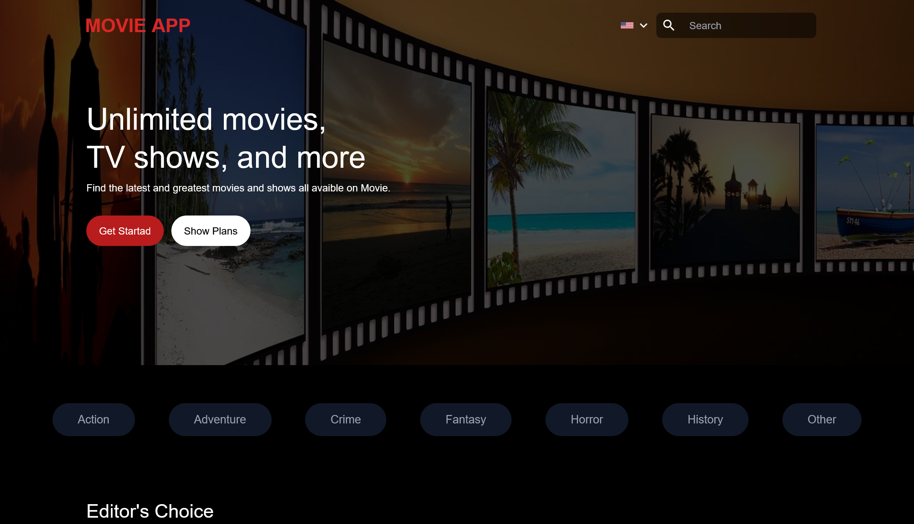
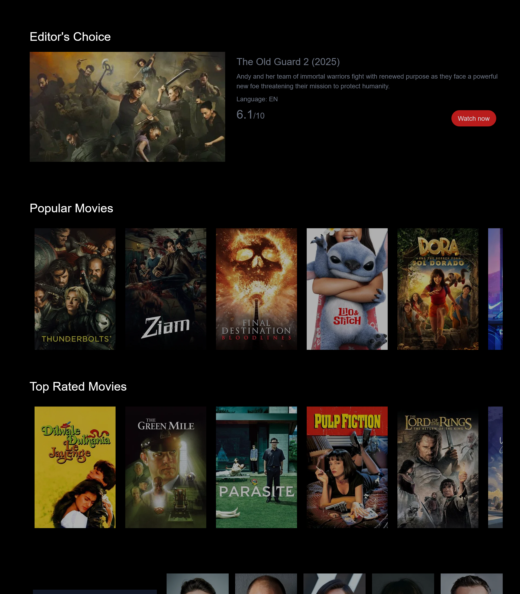
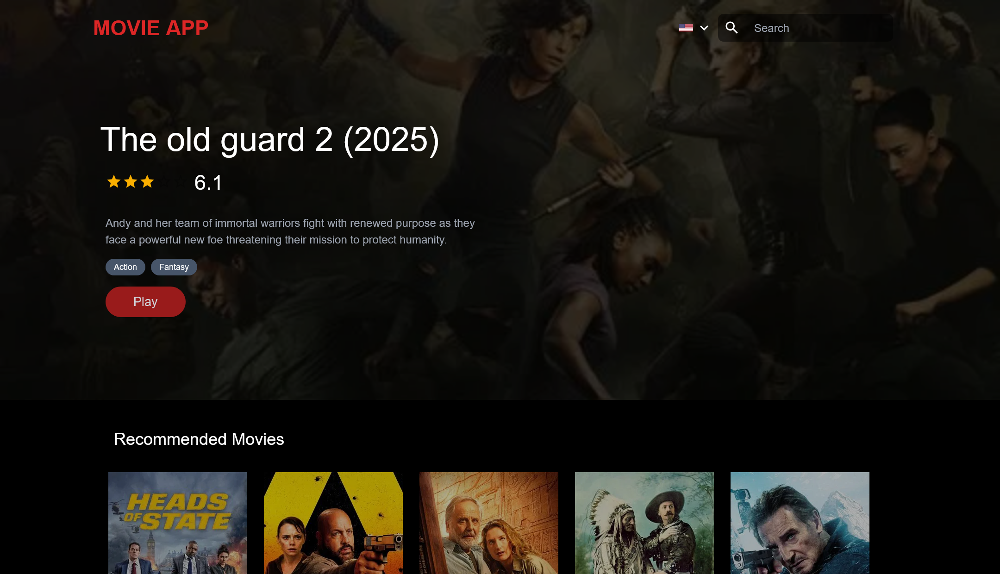

# 🎬 Movie Explorer – Built with Next.js & TheMovieDB API

**Movie Explorer** is a modern, responsive web application that allows users to browse, search, and discover movies using real-time data from [TheMovieDB API](https://www.themoviedb.org/documentation/api).

🔗 [Live Demo](https://movieapp-kappa-amber.vercel.app/)

## 🚀 Features

- 🔍 **Live Search** – Instantly search for movies by title
- 🎞️ **Browse by Categories** – View trending, popular, and top-rated films
- 📄 **Movie Detail Pages** – See posters, summaries, genres, release dates, and ratings
- 🎭 **Genre-Based Filtering** – Filter movies by genre (e.g. Action, Drama, Comedy)
- 🌙 **Dark/Light Mode** – Switch between themes for a better UX _(optional)_
- ⚡ **Fully Responsive** – Optimized for desktop and mobile devices

## 🛠️ Tech Stack

- [Next.js](https://nextjs.org/) – React Framework
- [TypeScript](https://www.typescriptlang.org/) – Type-safe development
- [Tailwind CSS](https://tailwindcss.com/) – Utility-first CSS framework
- [TheMovieDB API](https://www.themoviedb.org/documentation/api) – Movie data source
- [Vercel](https://vercel.com/) – Deployment platform _(optional)_

## 📸 Screenshots

|  |  |  |


## 📦 Installation

```bash
git clone https://github.com/mussarri/next-movie-app.git
cd next-movie-app
npm install
npm run dev
```

Create .env file and enter this values

```
NEXT_PUBLIC_TMDB_API_KEY=your_api_key_here
API_KEY=your_api_key_here
```

🔗 [Live Demo](https://movieapp-kappa-amber.vercel.app/)


